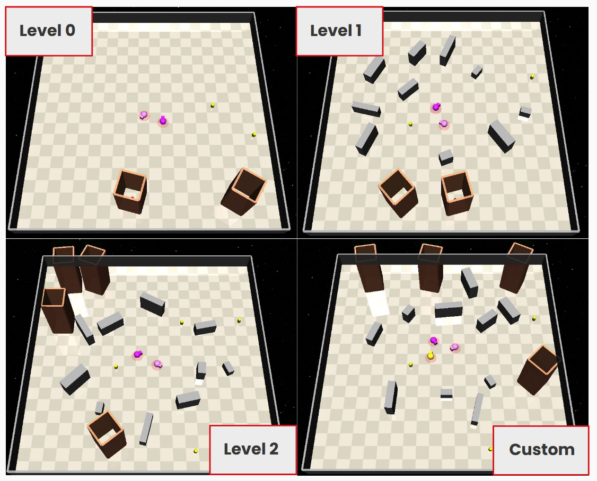

# RISE 2026: Search and Rescue Benchmark for RL Algorithms

This repository is a workspace that hopes to evaluate various RL algorithms, and specifically specification-guided RL algorithms, using Search and Rescue (SAR) environments. 

This research was conducted by Abdullah Khaled, Research Intern, under the mentorship of Zijian Guo, Graduate Student Mentor, with Professor Wenchao Li serving as Principal Investigator.

If you would like to see the development log, please visit [this GitHub repository](https://github.com/akhaled247/rise-26-devlog).

## Installation
```bash
conda create -n rise python=3.10 -y
conda activate rise
python -m pip install --upgrade pip setuptools wheel
# 1) SpecRLBench + vendored safety-gymnasium fork
cd SpecRLBench
pip install -e .
pip install -e specbench/envs/zones/safety-gymnasium
# 2) SafePO fork (algorithm source of truth) — no-deps is intentional
cd ../Safe-Policy-Optimization
pip install -e . --no-deps
# 3) RISE-Training package + runtime deps
cd ../RISE-Training
pip install -r requirements.txt
pip install -e .
# 3) GenZ-LTL + vendored safety-gymnasium fork
cd ../GenZ-LTL
pip install -e src/envs/zones/safety-gymnasium
pip install -r requirements.txt
```

## Training
Training on new environments can be done by updating [`GenZ-LTL/src/sequence/samplers/__init__.py`](GenZ-LTL/src/sequence/samplers/__init__.py). If you plan to evaluate on a multi-agent environment, currently the method used is to train on a single-agent environment then evaluate on a multi-agent environment.
```bash
# Level 0
cd GenZ-LTL /
PYTHONPATH=src/ /
python src/train/train_rco.py --env PointLTL0MASAR1WC-v0 --curriculum PointLTL0MASAR1WC-v0 --model_config PointLTL0MASAR2WC-v0 --name GenZ-RCO-SAR --seed 22 --vec_backend safety_async --fast_action_bridge --num_procs 24 --steps_per_process 4096 --batch_size 2048 --discount 0.998 --epochs 10 --target_kl 0.015 --target_cost -0.02 --min_lag 0.0 --max_lag 3.0 --entropy_coef 0.003 --lr 0.0002 --num_steps 10000000 --log_interval 1 --save_interval 10 --eval_interval 500000 --entr-bldg-obs --log_wandb
```

## Evaluation
To evaluate the trained model(s).
```bash
python RISE-Training/eval_genz_ma_sar.py --device cuda:1 --eval_env PointLTL0MASAR2WC-v0 --train_env PointLTL0MASAR1WC-v0 --exp GenZ-RCO-SAR --seed 1 --num_episodes 10 --zone-compat
```

## Visualization
To visualize the paths the agent(s) take during evaluation.
```bash
python RISE-Training/visuals/draw_sar_trajectories.py --train-env PointLTL0MASAR1WC-v0 --eval-env PointLTL0MASAR2WC-v0 --num-episodes 16 --exp GenZ-RCO-SAR --seed 1 --formula '(!(surface_0 | walls_0) U entrapped_0) & (!walls_0 U surface_0) --no-debug-reach-avoid --zone-compat
```

## Environments
All environments have surface and entrapped casualties, and the default setting is to rescue all entrapped casualites before rescuing all surface casualties.
- **Level 0**: One surface casualty and one entrapped
casualty
- **Level 1**: Level 0, but with walls
- **Level 2**: Level 1, but with two surface/entrapped casualties
- **Custom**: Variable surface/entrapped casualties, agents, walls, buildings (> number of entrapped casualties), object sizes



In addition, the repository has Single Goal tasks (e.g. only surface, entrapped casualties) at [`SpecRLBench/specbench/envs/zones/safety-gymnasium/safety_gymnasium/tasks/safe_multi_agent/tasks/single_goal_sar`](SpecRLBench/specbench/envs/zones/safety-gymnasium/safety_gymnasium/tasks/safe_multi_agent/tasks/single_goal_sar)

## Reference
This repository builds heavily off of the following projects: [SpecRLBench](https://github.com/BU-Depend-Lab/SpecRLBench/), [Safety-Gymnasium](https://github.com/PKU-Alignment/safety-gymnasium/tree/main), [GenZ-LTL](https://github.com/BU-DEPEND-Lab/GenZ-LTL), and [Safe Policy Optimization](https://github.com/PKU-Alignment/Safe-Policy-Optimization).
